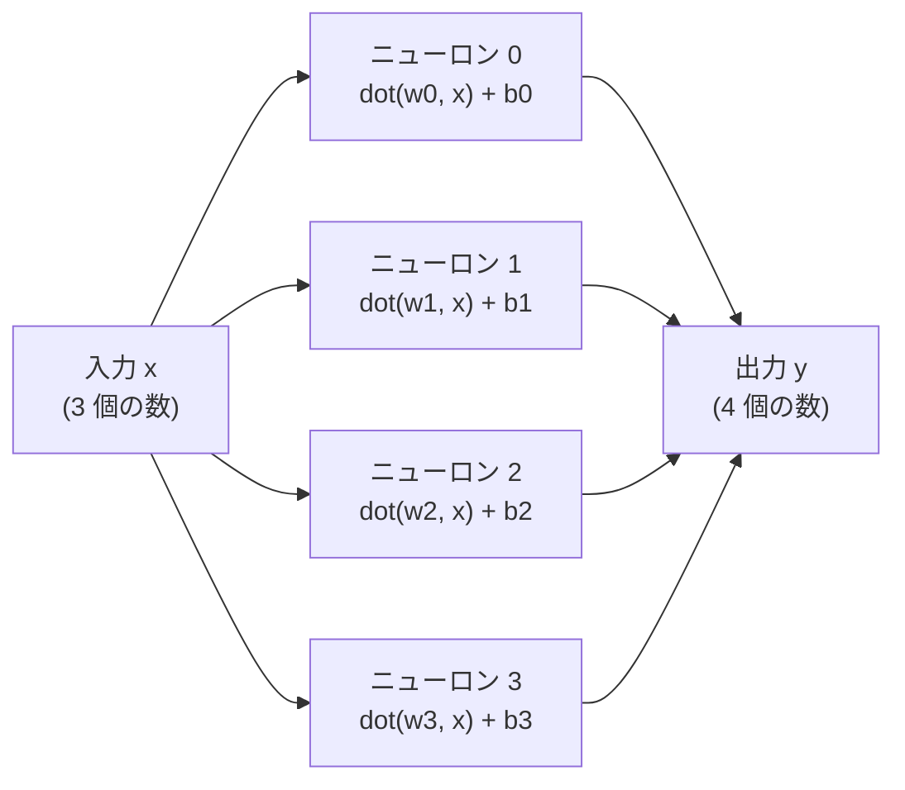

# 第3章 ニューロンと Dense

ここが、普通の解説なら「線形層 \( y = Wx + b \)」と行列で書かれる場所です。
この本では行列を使いません。代わりに**ニューロン**という言葉で書きます。

## ニューロン = 重み付き和 + バイアス

ニューロンは「入力の数の並びを受け取って、ひとつの数を返す関数」です。
自分の重み（入力と同じ長さの数の並び）との内積を取り、バイアスを足すだけ。

\[
\text{neuron}(x) = \sum_i w_i \, x_i + b
\]

```scala mdoc
import nomatrix.nn.*

val neuron = Neuron(weights = Vector(1.0, -2.0, 0.5), bias = 0.1)
neuron(Vector(2.0, 1.0, 4.0))   // 1*2 + (-2)*1 + 0.5*4 + 0.1
```

## Dense = ニューロンの集まり

入力ベクトルを、たくさんのニューロンに**同時に見せて**、それぞれの答えを並べたものが `Dense` です。
出力の長さは、ニューロンの数です。

```scala
final case class Dense(neurons: Vector[Neuron]):
  def apply(x: Vec): Vec = neurons.map(_(x))
```

これで終わりです。世間で「行列とベクトルの積」と呼ばれているものの正体は、
「ニューロンが並んでいて、それぞれが内積を取る」ことです。



## パラメータは「名前付きの数」

ニューロンの重みは学習で変わります。学習の対象になる数を、この本では `Params` にまとめます。
`Params` の正体は `Map[String, Double]`。名前がついた数の辞書です。

```scala mdoc
import scala.util.Random

val params = Dense.init("layer", in = 3, out = 2, new Random(0))
params.size
params.names.toVector.sorted
```

`layer.n1.w2` は「`layer` という Dense の、1 番目のニューロンの、2 番目の重み」です。
行列の「1 行 2 列」ではなく、**誰の何番目の重みか**が名前で分かります。

この辞書から `Dense.load` でニューロンを組み立てます。

```scala mdoc
val dense = Dense.load(params, "layer", in = 3, out = 2)
val x = Vector(1.0, 0.0, -1.0)
dense(x)
```

## 名前で動かす

学習とは「この辞書の数を変えること」です。試しに、ひとつの重みを名前で指定して 1.0 だけ増やしてみます。

```scala mdoc
val nudged = params.updated("layer.n0.w2", params("layer.n0.w2") + 1.0)
Dense.load(nudged, "layer", in = 3, out = 2)(x)
```

0 番目のニューロンの出力だけが、入力の 2 番目（-1.0）× 1.0 = -1.0 だけ動きました。
1 番目のニューロンは、自分の重みが変わっていないので動いていません。
「どの数を動かすと、出力のどこがどれだけ動くか」が、名前つきで追えます。
第11章の学習は、この「動かして見る」を全パラメータで繰り返すだけです。

## 初期値について

重みは `±1/√in` の範囲の一様乱数、バイアスは 0 から始めます。
入力が多いほど重みを小さくして、出力が入力と同じくらいのスケールに収まるようにしています。
これが崩れると、層を重ねたときに数が爆発したり消えたりします。

## 実装を読む

```scala
--8<-- "src/main/scala/nomatrix/nn/Dense.scala"
```

```scala
--8<-- "src/main/scala/nomatrix/nn/Params.scala"
```

!!! tip "この章のまとめ"
    - ニューロン = 内積 + バイアス。Dense = ニューロンの並び
    - 「行列とベクトルの積」は「ニューロンがそれぞれ内積を取る」の別名
    - パラメータは名前付きの数の辞書。名前で動かせる

次は、文字を数の並びに変える「埋め込み」です。
