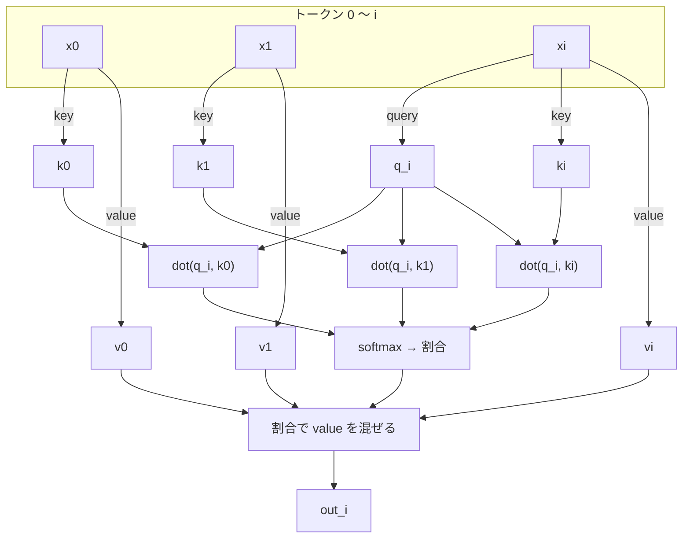

# 第6章 注意：似ているものを混ぜる

Transformer の名前の由来になった論文のタイトルは "Attention Is All You Need" でした。
この章では、その「注意（attention）」を行列なしで書きます。

## 問題: 文脈をどう取り込むか

「ねこが ね」の次は「る」でしょう。でも「ほしを み」の次は「る」で、「ほんを よ」の次は「む」。
次の文字を当てるには、**前のどの文字に注目するか**を決めて、その情報を取り込む必要があります。

注意は、この「注目して取り込む」を 3 ステップで行います。

## ステップ 1: query / key / value を作る

各トークンのベクトルから、3 つのベクトルを作ります。作り方は `Dense`（ニューロンの並び）です。

- **query**（問い）: 「私はどんな情報を探しているか」
- **key**（鍵）: 「私はどんな情報を持っているか」
- **value**（値）: 「実際に渡す情報」

```scala
val qs = xs.map(query(_))
val ks = xs.map(key(_))
val vs = xs.map(value(_))
```

## ステップ 2: 似ている度合いを測る

トークン \( i \) の query と、トークン \( j \) の key の**内積**を取ります。
第2章で見たとおり、内積は「似ている度合い」です。
探しているもの（query）と持っているもの（key）が合っていれば、大きな値になります。

\[
\text{score}_{i,j} = \frac{\text{dot}(q_i, k_j)}{\sqrt{d}}
\]

\( \sqrt{d} \) で割るのは、次元が増えると内積の値が大きくなりすぎて softmax が極端になるのを防ぐためです。

**未来は見ない。** トークン \( i \) が見ていいのは \( j \le i \) だけです。
次の文字を当てるモデルが、答えを見てしまってはいけません。
コードでは `(0 to i)` と書くだけ。「マスク行列」は要りません。

```scala
val scores = (0 to i).toVector.map(j => Vec.dot(qs(i), ks(j)) * scale)
```

## ステップ 3: 割合にして混ぜる

スコアを softmax で「合計 1 の割合」にし、その割合で value を混ぜ合わせます。

\[
\text{out}_i = \sum_{j \le i} \text{softmax}(\text{score}_i)_j \cdot v_j
\]

```scala
val weights = Vec.softmax(scores)
(0 to i).map(j => Vec.scale(vs(j), weights(j))).reduce(Vec.add)
```

「注目したトークンの value を、注目の強さぶんだけ取り込む」。これが注意のすべてです。



## 動かしてみる

```scala mdoc
import nomatrix.nn.*
import nomatrix.vec.Vec
import scala.util.Random

val params = AttentionHead.init("h", dModel = 4, headDim = 2, new Random(1))
val head = AttentionHead.load(params, "h", dModel = 4, headDim = 2)

val xs = Vector(
  Vector(1.0, 0.0, 0.0, 1.0),
  Vector(0.0, 1.0, 1.0, 0.0),
  Vector(0.5, 0.5, 0.5, 0.5)
)

head(xs)
```

3 トークン入れると、3 本の（headDim = 2 の）ベクトルが出てきます。

## 因果的であることの確認

3 番目のトークンを別のものに差し替えても、1 番目と 2 番目の出力は変わりません。
未来を見ていない証拠です。

```scala mdoc
val xs2 = xs.updated(2, Vector(-3.0, 2.0, 9.0, -1.0))
val before = head(xs)
val after  = head(xs2)

before(0) == after(0)
before(1) == after(1)
before(2) == after(2)
```

## 実装を読む

```scala
--8<-- "src/main/scala/nomatrix/nn/AttentionHead.scala"
```

普通の解説にある \( \text{softmax}(QK^\top / \sqrt{d}) V \) は、この 10 行ほどのループと同じものです。
行列で書くと 1 行になりますが、「誰が誰に、どれだけ注目するか」というループの形の方が、
やっていることは見えやすいはずです。

!!! tip "この章のまとめ"
    - query = 探しているもの、key = 持っているもの、value = 渡すもの
    - 内積で似ている度合いを測り、softmax で割合にし、value を混ぜる
    - 未来を見ないのは `(0 to i)` と書くだけ

次は、注意を複数並べる「Multi-Head」です。
