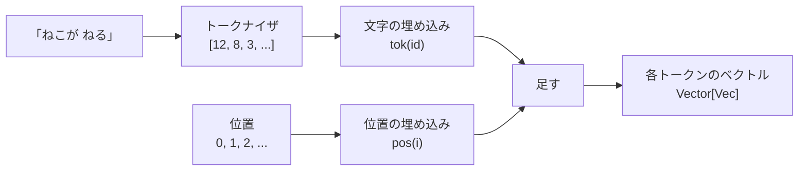

# 第6章 位置を知る

## 注意は順番を見ない

次の章で作る「注意」は、文中のすべてのトークンを平等に眺めます。
「ねこが ねる」と「ねる が ねこ」を区別する材料が、そのままでは何もありません。
トークンの中身しか見ないからです。

だから、**「自分は何番目か」を各トークンに教える**必要があります。

## 位置埋め込み: 位置にもベクトルを持たせる

やり方はいくつもありますが、いちばん素朴なのは「位置ごとにも数の並びを持つ表を用意して、
トークンのベクトルに足す」ことです。文字の埋め込みとまったく同じ仕組みです。

```scala mdoc
import nomatrix.nn.Embedding
import nomatrix.vec.Vec
import scala.util.Random

val rng = new Random(0)
val tokenTable = Embedding.load(Embedding.init("tok", count = 5, dim = 4, rng).lift, "tok", 5, 4)
val posTable   = Embedding.load(Embedding.init("pos", count = 8, dim = 4, rng).lift, "pos", 8, 4)

val ids = Vector(3, 1, 3)   // 同じトークン 3 が 0 番目と 2 番目に出てくる
val embedded = ids.zipWithIndex.map((id, pos) => Vec.add(tokenTable(id), posTable(pos)))

Vec.data(embedded(0))
Vec.data(embedded(2))
```

同じ文字「3」でも、0 番目と 2 番目では違うベクトルになりました。
位置の情報が「足し算」で混ぜ込まれたからです。

## なぜ足すだけでいいのか

「足したら文字の情報と位置の情報が混ざって区別できなくなるのでは」と思うかもしれません。
実際には、次元が十分あれば、学習によって「文字の情報はこの辺の次元、位置の情報はこの辺の次元」
という役割分担が自然に生まれます。後ろの層はニューロン（内積）で読むので、
必要な次元だけ重みを立てれば、必要な情報だけ取り出せます。

## 制約: context の長さ

位置の表は `context` 個ぶんしかありません。この本のモデルでは 16 です。
つまり、モデルは一度に 16 文字までしか見られません。
生成のときは、直近の 16 文字だけを見て次を決めます（第12章）。

!!! note "他の方式"
    元論文の Transformer は sin/cos で位置を作りました。最近のモデルは RoPE（回転位置埋め込み）が主流です。
    どれも「位置の情報を数の並びに混ぜる」という目的は同じで、行列は要りません。
    この本では、いちばん理解しやすい「学習する表」を使います。

## モデルの入口

ここまでで、Transformer の入口ができました。



第10章の `Transformer.logits` の最初の 1 行が、まさにこれです。

```scala
val embedded = ids.zipWithIndex.map((id, pos) => Vec.add(tokenEmbedding(id), positionEmbedding(pos)))
```

!!! tip "この章のまとめ"
    - 注意は順番を見ないので、位置を教える必要がある
    - 位置ごとの数の並びを表に持ち、文字の埋め込みに足す
    - 見られる長さは context（この本では 16 文字）まで

次はいよいよ、Transformer の心臓「注意」です。
