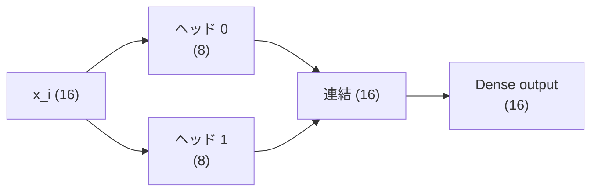

# 第7章 複数の視点：Multi-Head

## ひとつの注意では足りない

第6章の注意ヘッドは、「query と key が似ているトークン」に注目します。
でも、注目したい理由はひとつではありません。

- 直前の文字（「ね」の次は「こ」か「る」か）
- 文の先頭の単語（「あさ」で始まったなら「おきて」が来やすい）
- 直前の区切り（「。」の後は「あさ」「ひる」「よる」）

ひとつのヘッドに全部やらせると、softmax の割合を取り合って中途半端になります。
そこで、**ヘッドを複数並べて、それぞれに違う視点を持たせます**。

## やること: 並べて、つないで、混ぜる

1. `heads` 個の注意ヘッドを、それぞれ別のパラメータで作る
2. 各ヘッドの出力（短いベクトル）を、トークンごとに**連結**する
3. 連結したベクトルを `Dense` に通して、元の長さに戻す

```scala
final case class MultiHead(heads: Vector[AttentionHead], output: Dense):
  def apply(xs: Tokens): Tokens =
    val perHead = heads.map(_(xs))
    xs.indices.toVector.map { i =>
      val joined = perHead.map(_(i)).reduce(Vec.concat)
      output(joined)
    }
```

`dModel = 16`、`heads = 2` なら、各ヘッドは 8 次元で働き、連結して 16 に戻ります。
「ヘッド数で割る」のは、全体の計算量を変えずに視点を増やすためです。



## 動かしてみる

```scala mdoc
import nomatrix.nn.*
import nomatrix.vec.Vec
import scala.util.Random

val params = MultiHead.init("mh", dModel = 4, heads = 2, new Random(2))
params.size

val mh = MultiHead.load(params, "mh", dModel = 4, heads = 2)
val xs = Vector.fill(3)(Vector(0.1, -0.2, 0.3, 0.4))
mh(xs)
```

パラメータ数の内訳を確かめておきます。ヘッドあたり query / key / value の Dense が 3 つ（4→2 が 3 つで各 10 個）、
それが 2 ヘッドで 60 個。出力の Dense（4→4）が 20 個。合計 80 個です。

```scala mdoc
params.names.toVector.map(_.split('.').take(2).mkString(".")).distinct.sorted
```

## 実装を読む

```scala
--8<-- "src/main/scala/nomatrix/nn/MultiHead.scala"
```

「ヘッドの次元をまとめて一度に計算する」ための reshape や転置は、ここにはありません。
ヘッドは本当に独立した `AttentionHead` のインスタンスで、`map` で順に呼ぶだけです。

!!! tip "この章のまとめ"
    - 注目したい理由は複数あるので、ヘッドを複数並べる
    - 各ヘッドは短いベクトルで働き、連結して Dense で戻す
    - ヘッドは独立したオブジェクト。`map` で呼ぶだけ

次は、注意と組み合わせてブロックを作る「FeedForward・残差・LayerNorm」です。
