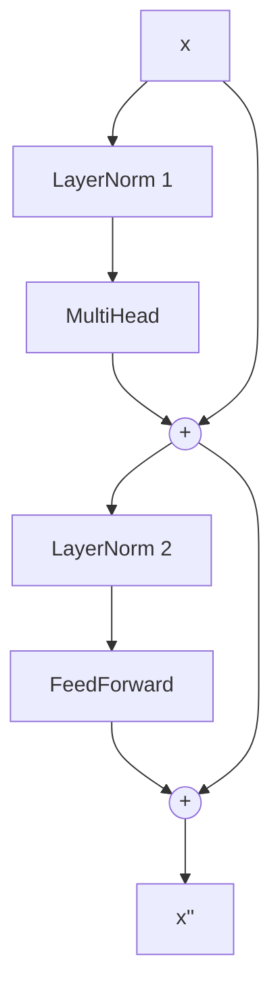

# 第9章 FeedForward・残差・LayerNorm

注意は「トークン同士で情報を混ぜる」部品でした。
Transformer のブロックは、それにあと 3 つの部品を組み合わせてできています。

## FeedForward: トークンごとに考える

注意で集めた情報を、各トークンが**自分の中で**処理する部品です。
`Dense` で次元を広げ、ReLU で折り曲げ、`Dense` で戻します。

```scala
final case class FeedForward(up: Dense, down: Dense):
  def apply(x: Vec): Vec = down(Vec.relu(up(x)))
```

ReLU は「負なら 0、正ならそのまま」。この折り曲げがないと、Dense を 2 つ重ねても
1 つの Dense と同じ表現力にしかなりません（重み付き和の重み付き和は、重み付き和）。

```scala mdoc
import nomatrix.nn.*
import nomatrix.vec.Vec
import scala.util.Random

val ff = FeedForward.load(FeedForward.init("ff", dModel = 3, hidden = 6, new Random(3)).lift, "ff", 3, 6)
Vec.data(ff(Vec.fromDoubles(Seq(1.0, -1.0, 0.5))))
```

`hidden` は `dModel` の 2〜4 倍にするのが慣例です。この本では 16 → 32 → 16。

## 残差接続: 元の情報を捨てない

ブロックの出力を「部品の出力」ではなく「**入力 + 部品の出力**」にします。

```scala
val afterAttention = xs.zip(mixed).map(Vec.add)
```

これが残差接続です。理由は 2 つあります。

1. **学習しやすい**: 部品は「入力をどう変えるか（差分）」だけ学べばよい。最初は何もしなくても入力がそのまま通る。
2. **勾配が届く**: 逆伝播のとき、足し算の枝を通って勾配がそのまま入力側へ流れる。層を重ねても消えない。

`Vec.add` するだけ。行列も、特別な仕組みも要りません。

## LayerNorm: 入口で整える

第3章の `layerNorm`（平均 0・分散 1）に、次元ごとのゲインとバイアスを付けたものです。

```scala
final case class LayerNorm(gain: Vec, bias: Vec):
  def apply(x: Vec): Vec = Vec.add(Vec.mul(gain, Vec.layerNorm(x)), bias)
```

ゲインは 1、バイアスは 0 から始めるので、最初は素の `layerNorm` と同じです。
学習が進むと、「この次元は大きめに使う」といった調整を覚えます。

各部品の**前**に置きます（Pre-LN）。残差の本線には触らず、部品に渡す枝だけ整えるので、安定します。

## ブロック = 4 つを組み合わせる

\[
\begin{aligned}
x' &= x + \text{MultiHead}(\text{LayerNorm}_1(x)) \\
x'' &= x' + \text{FeedForward}(\text{LayerNorm}_2(x'))
\end{aligned}
\]

```scala
final case class Block(norm1: LayerNorm, attention: MultiHead, norm2: LayerNorm, feedForward: FeedForward):
  def apply(xs: Tokens): Tokens =
    val mixed = attention(xs.map(norm1(_)))
    val afterAttention = xs.zip(mixed).map(Vec.add)
    afterAttention.map(x => Vec.add(x, feedForward(norm2(x))))
```



上半分が「トークン同士で混ぜる」、下半分が「トークンごとに考える」。
この 2 つを交互に繰り返すのが Transformer です。

## 動かしてみる

```scala mdoc
val block = Block.load(Block.init("b0", dModel = 4, heads = 2, hidden = 8, new Random(4)).lift, "b0", 4, 2, 8)
val xs = Vector(Seq(1.0, 2.0, 3.0, 4.0), Seq(4.0, 3.0, 2.0, 1.0)).map(Vec.fromDoubles)
block(xs).map(Vec.data)
```

入力の形（2 トークン × 4 次元）が保たれています。だから何段でも積めます。

## 実装を読む

```scala
--8<-- "src/main/scala/nomatrix/nn/FeedForward.scala"
```

```scala
--8<-- "src/main/scala/nomatrix/nn/LayerNorm.scala"
```

```scala
--8<-- "src/main/scala/nomatrix/nn/Block.scala"
```

!!! tip "この章のまとめ"
    - FeedForward = 広げて、折り曲げて、戻す。トークンごとに独立
    - 残差 = 入力を足す。学習しやすく、勾配が届く
    - LayerNorm = 部品の入口で整える
    - ブロックは形を保つので、何段でも積める

次は、ブロックを積んで Transformer を完成させます。
