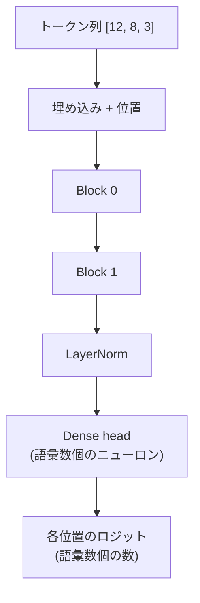

# 第10章 ブロックを積む — Transformer

部品が揃いました。組み立てます。

## 全体の流れ

1. 文字の埋め込み + 位置の埋め込み（第5-6章）
2. ブロック × `layers`（第9章）
3. 最後に LayerNorm で整える
4. 語彙の数だけニューロンを並べた `Dense` で、「次の文字はどれか」のスコア（**ロジット**）を出す

```scala
def logits(ids: Vector[Int]): Tokens =
  val embedded = ids.zipWithIndex.map((id, pos) => Vec.add(tokenEmbedding(id), positionEmbedding(pos)))
  val hidden = blocks.foldLeft(embedded)((xs, block) => block(xs))
  hidden.map(x => head(finalNorm(x)))
```

`foldLeft` でブロックを順に通す。それだけです。



## 出力は「各位置ごと」に出る

入力が 3 トークンなら、出力も 3 本のベクトルです。
位置 \( i \) のロジットは「位置 \( i \) までを見たとき、位置 \( i+1 \) は何か」の予測です。
学習では全位置を同時に使い（第11章）、生成では最後の位置だけを使います（第12章）。

## Config: モデルの大きさ

```scala
final case class Config(vocabSize: Int, dModel: Int, heads: Int, layers: Int, context: Int, hidden: Int)
```

この本の既定値です。

| 名前 | 値 | 意味 |
|---|---|---|
| `vocabSize` | コーパスによる（同梱コーパスでは 64） | 文字の種類 |
| `dModel` | 16 | 各トークンのベクトルの長さ |
| `heads` | 2 | 注意ヘッドの数（各 8 次元） |
| `layers` | 2 | ブロックの段数 |
| `context` | 16 | 一度に見る文字数 |
| `hidden` | 32 | FeedForward の中間の長さ |

## 動かしてみる

```scala mdoc
import nomatrix.model.*
import nomatrix.nn.*
import nomatrix.vec.Vec
import scala.util.Random

val cfg = Config(vocabSize = 7, dModel = 4, heads = 2, layers = 2, context = 5, hidden = 8)
val params = Transformer.init(cfg, new Random(5))
params.size

val model = Transformer.load(cfg, params.lift)
val out = model.logits(Vector(1, 2, 3))
out.length
out.map(v => Vec.data(v).map(d => f"$d%.3f"))
```

3 トークン入れて、各位置に 7 個（語彙数）のスコアが出ました。まだ学習していないので意味はありません。

## パラメータ数を数える

「約 7,000 個」と言ってきた根拠を出します。既定の設定で数えてみます。

```scala mdoc
import nomatrix.data.Corpus

val real = Corpus.defaultConfig(Corpus.tokenizer.vocabSize)
Transformer.parameterCount(real)
```

内訳を名前の先頭で集計すると、どこに数が多いか分かります。

```scala mdoc
Transformer.init(real, new Random(0)).names
  .groupBy(_.split('.').head)
  .map((k, v) => k -> v.size)
  .toVector.sortBy(-_._2)
```

ブロック 1 つあたり約 2,200 個。埋め込みと出力ヘッドは語彙数に比例します。

## 勾配は端から端まで届く

損失をひとつ作って逆伝播すると、出力ヘッドから埋め込みまで、すべてのパラメータに勾配が届きます。

```scala mdoc
import nomatrix.autograd.Value

val pv = params.lift
val loss = Value.sum(Transformer.load(cfg, pv).logits(Vector(0, 1)).flatten)
val g = pv.gradients(Value.gradients(loss))
g("head.n0.b")
g("tok.t1.d0")
g("block0.attn.head0.query.n0.w0")
```

第2章で作った `Value` が、Transformer 全体を貫いて働いています。

## 実装を読む

```scala
--8<-- "src/main/scala/nomatrix/model/Transformer.scala"
```

50 行足らずです。行列がないぶん、部品の名前がそのまま構造になっています。

!!! tip "この章のまとめ"
    - 埋め込み → ブロックを `foldLeft` → LayerNorm → 語彙ぶんのニューロン
    - 出力は各位置ごとの「次の文字のスコア」
    - パラメータは約 7,000 個、すべて名前付きの数

次は、このモデルに「正しい次の文字」を教える方法、損失と学習です。
