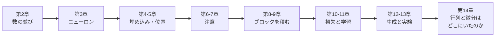

# 行列を使わない Transformer 入門

## なぜ行列を使わないのか

Transformer の解説を開くと、たいてい最初に \( Q K^\top / \sqrt{d_k} \) のような式が出てきます。
行列の積、転置、バッチ次元。そのあとに「損失関数を微分して勾配を求め」と続きます。
線形代数と微積分。どちらかで手が止まる人は多いはずです。

でも、Transformer の中で本当に起きていることは、次の 3 つだけです。

1. **数をかけて足す**（重み付き和）
2. **似ている度合いを測る**（内積 = かけて足す）
3. **割合にして混ぜる**（softmax）

そして、学習で本当に起きていることも 1 つだけです。

4. **少し動かして試し、良かった方へ寄る**

行列は 1〜3 を「まとめて書く記法」で、GPU で「まとめて速く計算する手段」です。
微分は 4 を「全部の方向について一度に試す手段」です。
どちらも本質ではなく、高速化の道具です。それを脇に置けば、Transformer も、その学習も、「数」と「関数」と「試すこと」だけで書けます。
このチュートリアルでは、それを本当にやってみます。

!!! note "このプロジェクトの約束"
    ソースコードの本線に、行列型（2 次元配列）も行列積も、微分も登場しません。
    行列の約束は[テストで機械的に検査](https://github.com/kmizu/no-matrix-transformer/blob/main/src/test/scala/nomatrix/NoMatrixTest.scala)されています。
    登場するのは `Double`（ただの数）と「数の並び」 `Vector[Double]` だけです。
    逆伝播（速い学習法）は[付録](15-backprop.md)に隔離してあり、そこでも微分の公式は使わず「部品の傾きを測って、掛けて、足す」だけで組み立てています。本線と同じ答えを出すことはテストで確かめています。

## 何ができあがるか

- ニューロン・注意（attention）・FeedForward・LayerNorm を「数と関数」で書いた Transformer
- 「少し動かして試す」だけで学習する学習器（微分なし）
- ひらがなの小さなコーパスで学習し、続きの文を生成する CLI

パラメータ数は約 7,000 個。GPU なしで、ノート PC の CPU で学習できます。

## 読み方

各章は「考え方 → 動くコード → 実際の出力」の順で進みます。
コードは [GitHub リポジトリ](https://github.com/kmizu/no-matrix-transformer)にあり、`sbt test` で全部のテストが走ります。
本文中のコードは、サイトを生成するたびに実際にコンパイル・実行され、出力がそのまま埋め込まれています。

前提知識は「関数」と「リスト」くらいです。微分も行列も要りません。Scala を知らなくても、コードは読めるように書いています。

それでは、[第1章 準備](01-setup.md)から始めましょう。
