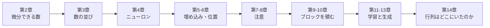

# 行列を使わない Transformer 入門

**行列を一度も書かずに**、Transformer ベースの小さな言語モデル（SLM）を Scala で組み立てます。
このサイトに載っているコードは、すべて実際にコンパイル・実行され、その出力がそのまま埋め込まれています。

## なぜ行列を使わないのか

Transformer の解説を開くと、たいてい最初に \( Q K^\top / \sqrt{d_k} \) のような式が出てきます。
行列の積、転置、バッチ次元。線形代数に慣れていないと、そこで手が止まります。

でも、Transformer の中で本当に起きていることは、次の 3 つだけです。

1. **数をかけて足す**（重み付き和）
2. **似ている度合いを測る**（内積 = かけて足す）
3. **割合にして混ぜる**（softmax）

行列はこれらを「まとめて書く記法」であり、GPU で「まとめて速く計算する手段」です。
記法と高速化を脇に置けば、Transformer は「数」と「関数」だけで書けます。
このチュートリアルでは、それを本当にやってみます。

!!! note "このプロジェクトの約束"
    ソースコードに行列型（2 次元配列）も行列積も登場しません。
    その約束は[テストで機械的に検査](https://github.com/kmizu/no-matrix-transformer/blob/main/src/test/scala/nomatrix/NoMatrixTest.scala)されています。
    登場するのは `Double`、微分できる数 `Value`、そして「数の並び」 `Vector[Value]` だけです。

## 何ができあがるか

- スカラー（ひとつの数）だけで動く自動微分
- ニューロン・注意（attention）・FeedForward・LayerNorm を「数と関数」で書いた Transformer
- ひらがなの小さなコーパスで学習し、続きの文を生成する CLI

パラメータ数は約 7,000 個。GPU なしで、ノート PC の CPU で数分で学習できます。

## 読み方

各章は「考え方 → 動くコード → 実際の出力」の順で進みます。
コードは [GitHub リポジトリ](https://github.com/kmizu/no-matrix-transformer)にあり、`sbt test` で全部のテストが走ります。

前提知識は「関数」「リスト」「微分は傾き」くらいです。Scala を知らなくても、コードは読めるように書いています。

それでは、[第1章 準備](01-setup.md)から始めましょう。
